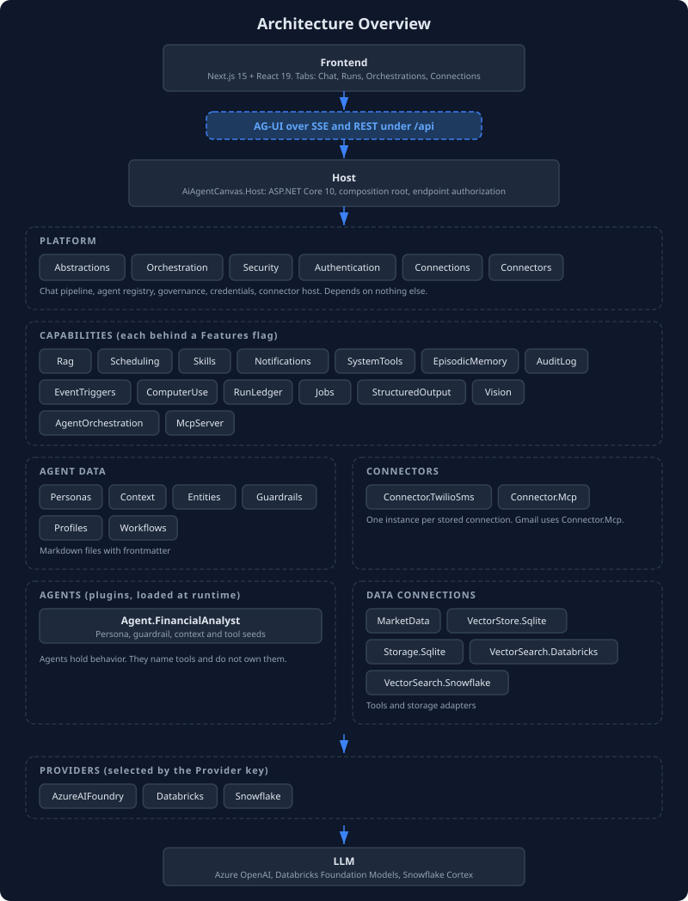
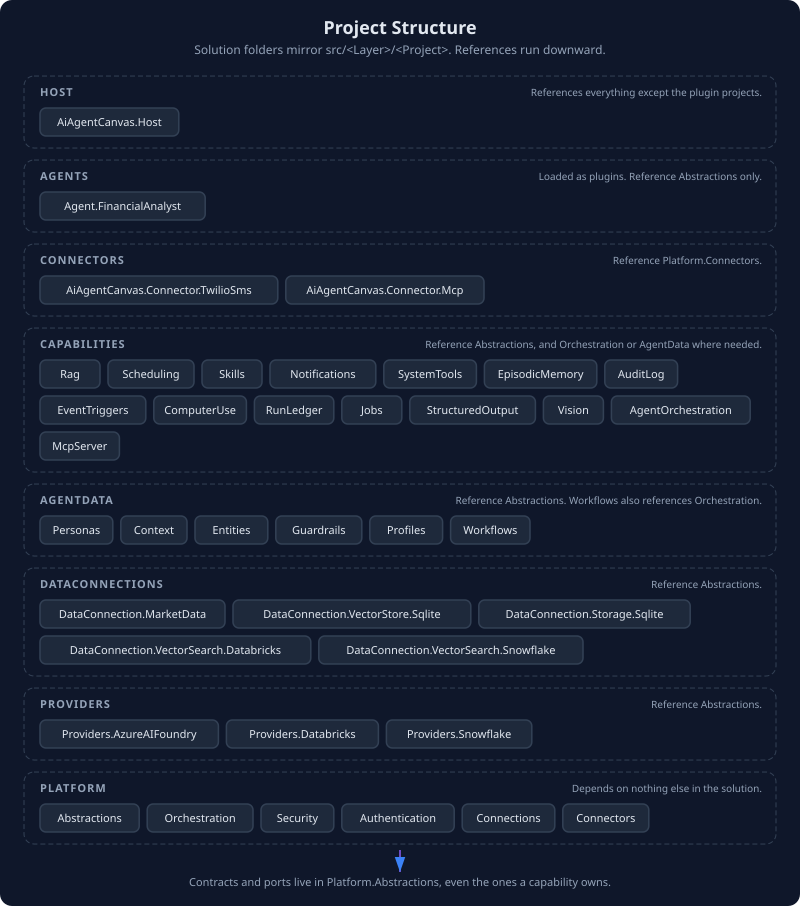
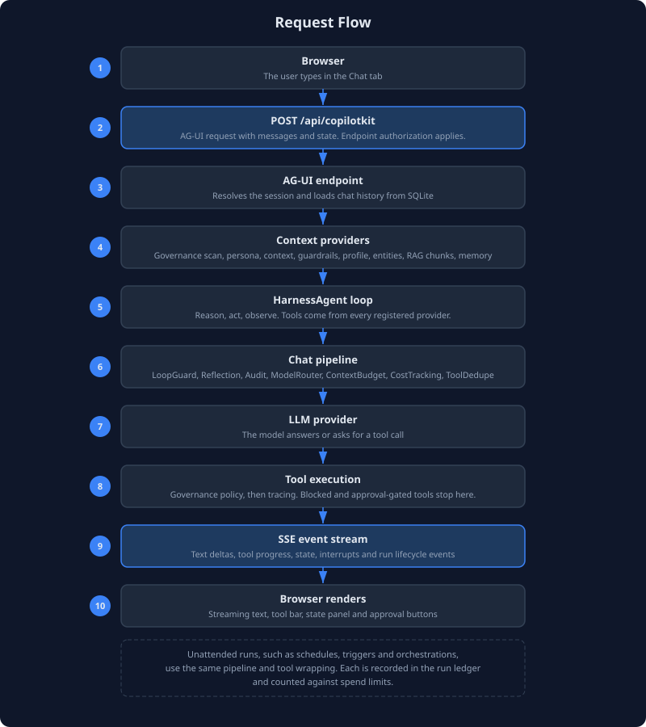

# 9. Architecture

The solution is organized into layers under `src/<Layer>/<Project>/`, and the Visual Studio solution folders mirror that tree one to one. References run downward. A project may depend on a layer below it and never on one above, which keeps the dependency graph clean: you can change a capability without touching the platform, or swap a data connection without affecting agent logic.



## Layer Overview

```
Host ──> Capabilities, AgentData, Connectors, DataConnections, Providers, Platform
Capabilities ──> AgentData, Platform
AgentData, Connectors, DataConnections, Providers, Agents ──> Platform
Platform ──> nothing else in the solution
```

Agents are loaded as plugins at runtime, so the Host holds no compile-time reference to them.

| Layer | What It Does |
|---|---|
| **Host** | ASP.NET Core composition root. Binds the `Features` flags, wires the layers together, and maps the HTTP endpoints with their authorization. The only project that references most of the others. |
| **Agents** | Custom agent projects. Each implements `IServiceModule` to self-register its persona, tool names and seeds. They reference only `AiAgentCanvas.Abstractions`. The host discovers them in the `plugins/` folder. |
| **Connectors** | One project per outside service: `Connector.TwilioSms` and `Connector.Mcp`, which Gmail uses. Each reference `Platform.Connectors`. |
| **Platform** | The engine and cross-cutting concerns: shared contracts, the agent runtime and chat pipeline, governance, authentication, the credential store and the connector host. |
| **Capabilities** | Opt-in feature modules, each behind a `Features:*` flag. |
| **AgentData** | Six context domains that store and provide agent knowledge: personas, context, entities, guardrails, profiles and workflows. |
| **DataConnections** | Tool providers and storage adapters: SQLite stores, the vector store, vector search and market data. |
| **Providers** | The LLM backend, chosen by the `Provider` key: Azure AI Foundry, Databricks or Snowflake. |

Ports belong in `AiAgentCanvas.Abstractions`, including the ones a capability owns, such as `IAgentMessaging`, `IScheduledTaskStore`, `IRunLedger`, `ICredentialProvider` and `IStructuredResponder`. A capability that defined an interface in its own project would force its storage adapter to depend upward on the capability, which breaks the layering.



## Project Reference Map

Each project and what it references, taken from the project files.

| Layer | Project | References |
|---|---|---|
| Platform | `Abstractions` | none |
| Platform | `Orchestration` | Abstractions |
| Platform | `Security` | Abstractions |
| Platform | `Authentication` | Abstractions |
| Platform | `Connections` | Abstractions |
| Platform | `Connectors` | Abstractions, Connections, Orchestration |
| Capabilities | `AuditLog`, `ComputerUse`, `EpisodicMemory`, `EventTriggers`, `Jobs`, `Notifications`, `Rag`, `RunLedger`, `StructuredOutput`, `SystemTools`, `Vision` | Abstractions |
| Capabilities | `Skills`, `AgentOrchestration`, `McpServer` | Abstractions, Orchestration |
| Capabilities | `Scheduling` | Abstractions, AgentData.Personas |
| AgentData | `Personas`, `Context`, `Entities`, `Guardrails`, `Profiles` | Abstractions |
| AgentData | `Workflows` | Abstractions, Orchestration |
| Connectors | `Connector.TwilioSms`, `Connector.Mcp` | Platform.Connectors |
| DataConnections | `MarketData`, `Storage.Sqlite`, `VectorStore.Sqlite`, `VectorSearch.Databricks`, `VectorSearch.Snowflake` | Abstractions |
| Providers | `AzureAIFoundry`, `Databricks`, `Snowflake` | Abstractions |
| Agents | `Agent.FinancialAnalyst` | Abstractions |

The Host references all the projects above except `Agent.FinancialAnalyst` and `DataConnection.MarketData`, which are plugins loaded from the `plugins/` folder (see Service Modules below).

## Projects in Detail

### Platform Layer

| Project | Purpose | Key Types |
|---|---|---|
| **Abstractions** | Interfaces and contracts. All other projects reference this. | `IServiceModule`, `IAgentRegistry`, `IAgentHandoff`, `IAgentMessaging`, the seed interfaces (`IPersonaSeed`, `IAgentToolsSeed`, `IContextSeed`, `IWorkflowSeed`, `IEntitySeed`, `IGuardrailSeed`, `ISkillSeed`, `IUserProfileSeed`, `IGoalSeed`, `IMcpConnectionSeed`), `IRunLedger`, `RunTracking`, `AgentRunContext`, `IBudgetGuard`, `IAgentJob`, `ICredentialProvider`, `IConnectorEventSink`, `IStructuredResponder`, `ToolStateMapping` |
| **Orchestration** | Agent runtime and coordination. Builds agents from seeds, runs the AG-UI and A2A servers, and owns the chat pipeline. | `AgentRegistry`, `AgentPipeline`, `InProcessAgentHandoff`, `InProcessAgentMessaging`, `HandoffToolProvider`, `ContextBudgetChatClient`, `LoopGuardChatClient`, `CostTrackingChatClient`, `BudgetGuard`, `CoreServiceExtensions` |
| **Security** | Governance and policy enforcement. Wraps tool calls with policy checks and injects security context. | `GovernedAIFunction`, `GovernanceToolWrapper`, `GovernedMcpGateway`, `GovernanceContextProvider` |
| **Authentication** | Pluggable endpoint authentication. Schemes are picked by name from `Authentication:Schemes`. | `IAgentAuthenticationScheme`, `ApiKeyScheme`, `RequireAgentAuthorization` |
| **Connections** | Encrypted credential store, the OAuth authorization code flow with PKCE, and token refresh. | `ConnectionStore`, `CredentialProvider`, `OAuthService`, `ConnectionEndpoints` |
| **Connectors** | Connector contracts, the host that runs one connector per stored connection, the guarded HTTP client, and the webhook route. | `IConnectorDefinition`, `IToolConnector`, `IEventSourceConnector`, `ConnectorHost`, `ConnectorTools` |

### The Chat Pipeline

The model is wrapped in a chain of delegating chat clients before an agent sees it. `AgentPipeline` builds the chain, and the default agent and the persona agents use it. From the outside in:

```
LoopGuard ─ Reflection ─ Audit ─ ModelRouter ─ ContextBudget ─ CostTracking ─ ToolDedupe ─ provider
```

| Client | Job |
|---|---|
| `LoopGuardChatClient` | Ends a run that has used its tool rounds, token budget or cost cap, or that repeats itself or stops making progress. It withdraws the tools and asks the model to report what it has. |
| `ReflectiveChatClient` | Optional. Injects a reflection prompt after a number of consecutive tool rounds. |
| `AuditingChatClient` | Present when `AuditLog` is on. Records each model call. |
| `CostAwareModelRouter` | Optional. Sends simple turns to the economy model. |
| `ContextBudgetChatClient` | Counts the prompt with the model's tokenizer, enforces a ceiling per component and compacts history with a summarizer. |
| `CostTrackingChatClient` | Records tokens and estimated cost for each call, streaming included. |
| `ToolDeduplicatingChatClient` | Removes duplicate tool definitions. |

Tools get the same treatment from `AgentPipeline.WrapTools`: the governance wrapper first, then `TracedAIFunction`, which records a span and the call in the ambient run record.

### AgentData Layer

Six domain-specific projects that store and provide agent knowledge. Each follows the same pattern: a store for persistence, tools for LLM access, and a context provider for automatic injection.

| Domain | Store | Tools | Context Provider |
|---|---|---|---|
| **Personas** | `PersonaStore` | `create_persona`, `update_persona`, `list_personas`, `read_persona`, `switch_persona`, `delete_persona` | `PersonaContextProvider` injects the active persona |
| **Context** | `PersistentContextStore` | `save_context`, `update_context`, `list_context`, `read_context`, `delete_context` | `PersistentContextProvider` injects all stored entries |
| **Entities** | `EntityStore` | `save_entity`, `update_entity`, `read_entity`, `search_entities`, `list_entities`, `delete_entity` | `EntityContextProvider` injects the entity index |
| **Guardrails** | `GuardrailStore` | `create_guardrail`, `update_guardrail`, `list_guardrails`, `toggle_guardrail`, `delete_guardrail` | `GuardrailContextProvider` injects enabled rules |
| **Profiles** | `UserProfileStore` | `create_user_profile`, `update_user_profile`, `switch_user_profile`, `read_user_profile`, `list_user_profiles`, `delete_user_profile` | `UserProfileContextProvider` injects the active profile |
| **Workflows** | `WorkflowStore` | `create_workflow`, `list_workflows`, `read_workflow`, `run_workflow`, `run_sequential_workflow`, `run_concurrent_workflow`, `delete_workflow`, plus `list_declarative_workflows` and `run_declarative_workflow` | None. Workflows run on request. |

### Capabilities Layer

Features that agents use but that are not specific to any single domain. Each is registered only when its flag is on.

| Capability | What It Provides | Key Types |
|---|---|---|
| **Skills** | Reusable prompt-template procedures, a skill registry, runtime authoring and the MCP connection manager | `SkillStore`, `SkillToolProvider`, `SkillAuthoringToolProvider`, `LocalSkillRegistry`, `McpConnectionManager` |
| **Scheduling** | Cron-based and one-time scheduled tasks that run an agent or a job | `ScheduledTaskRunner`, `ScheduledAgentJob`, `SchedulerToolProvider` |
| **Notifications** | Agent-to-user notification delivery over SSE | `InMemoryNotificationSink`, `NotificationEndpoint` |
| **SystemTools** | File read, write and list and script execution inside allowlists | `SystemToolProvider`, `SystemToolOptions` |
| **RAG** | Chunking, hybrid retrieval, LLM reranking and cited context | `DocumentChunker`, `LlmReranker`, `RagContextProvider` |
| **EpisodicMemory** | Cross-session memory with relevance decay, search and context injection | `EpisodicMemoryStore`, `EpisodicMemoryToolProvider`, `EpisodicMemoryContextProvider`, `MemoryDecayService` |
| **AuditLog** | Model call and tool call audit trail with sensitive parameter redaction | `AuditLogStore`, `AuditingChatClient`, `AuditLogToolProvider` |
| **EventTriggers** | Scheduled, file-watch, webhook and connector triggers held in a durable queue | `TriggerRegistry`, `TriggerStore`, `TriggerEventQueue`, `TriggerDispatchService`, `ConnectorEventBridge` |
| **ComputerUse** | Browser automation through headless Chromium (Playwright) | `BrowserSession`, `ComputerUseToolProvider` |
| **RunLedger** | One record per unattended run, with usage, tool calls and outcome | `SqliteRunLedger`, `RunLedgerEndpoints`, `RunLedgerToolProvider` |
| **Jobs** | Deterministic work that runs without a model | `JobRunner`, `JobToolProvider` |
| **StructuredOutput** | Schema-checked answers with retry | `StructuredResponder`, `JsonSchemaValidator`, `SchemaCatalog` |
| **Vision** | Image tools with allowlisted sources | `ImageLoader`, `VisionToolProvider` |
| **AgentOrchestration** | Group chat, handoff and Magentic runs with checkpoints and human sign-off | `OrchestrationRunner`, `OrchestrationStore`, `OrchestrationEndpoints` |
| **McpServer** | Serves chosen tools over MCP | `ExposedToolSet`, `McpServerExtensions` |

Connections and connectors sit in the Platform layer because other projects depend on them. `Platform.Connections` stores credentials and runs OAuth. `Platform.Connectors` defines the connector contracts and runs one connector per stored connection. See [Operations and Connectors](guide-11-operations-and-connectors.md).

### DataConnections and Providers

Storage backends and external data sources. These projects implement the persistence and data-access interfaces defined in Abstractions.

**DataConnections:**

| Project | Purpose | Key Types |
|---|---|---|
| **Storage.Sqlite** | SQLite store for scheduled tasks | `SqliteScheduledTaskStore`, `SqliteStoreBase` |
| **VectorStore.Sqlite** | SQLite vector store for RAG embeddings, and the chat history provider | `SqliteVectorStore`, `SqliteChatHistoryProvider` |
| **MarketData** | Stock quotes, price history and SEC EDGAR company facts. A plugin. | `MarketDataToolProvider` |
| **VectorSearch.Databricks** | Databricks Vector Search index queries for grounding | `DatabricksVectorSearchToolProvider` |
| **VectorSearch.Snowflake** | Snowflake Cortex Search queries for grounding | `SnowflakeCortexSearchToolProvider` |

**Providers:**

| Project | Purpose |
|---|---|
| **Providers.AzureAIFoundry** | LLM client for Azure AI Foundry (Azure OpenAI) endpoints |
| **Providers.Databricks** | LLM client for Databricks Foundation Model APIs (OpenAI-compatible) |
| **Providers.Snowflake** | LLM client for Snowflake Cortex |

Each provider registers its chat client and, where configured, embeddings plus keyed `economy` and `judge` clients.

## Frontend

The frontend is a Next.js 15 application using React 19. It connects to the backend through the AG-UI protocol, a raw SSE (Server-Sent Events) client that consumes the event stream directly. There is no CopilotKit SDK dependency. The client handles event types such as `TEXT_MESSAGE_CONTENT`, `TOOL_CALL_START`, `TOOL_CALL_END`, `STATE_SNAPSHOT` and `STATE_DELTA` to render the chat, tool activity and live state.

The page has four tabs. **Chat** is the conversation. **Runs** lists the run ledger with totals and run detail. **Orchestrations** shows multi-agent runs and is where a person answers a plan review. **Connections** adds, checks and removes connected accounts. In development, `npm run dev` forwards `/api` requests to the backend on `http://localhost:5149`. A production build is a static export that the Host serves from `wwwroot`.



## Request Flow

A user message travels through the system in this sequence:

1. **Frontend POSTs to `/api/copilotkit`**, the AG-UI endpoint. The request carries the user message, conversation history and frontend state. Endpoint authorization applies when authentication is on.

2. **AG-UI server resolves the session**, identifies the user, loads conversation history and prepares the agent context.

3. **Context providers inject data.** Each registered `AIContextProvider` appends its knowledge to the system prompt: the governance scan, the default prompt, persona instructions, context entries, guardrail rules, the user profile, the entity index, and RAG results and episodic memory when those capabilities are on.

4. **HarnessAgent runs the agent loop.** The agent built through `AsHarnessAgent` executes the reason-act-observe cycle. Each model call goes through the chat pipeline described above.

5. **Tool calls pass the governance wrapper and tracing.** The `GovernedMcpGateway` evaluates a call against the policy file and the approval-required list. A blocked call returns an error message and does not execute. Each decision is logged as an audit event.

6. **Results stream as AG-UI SSE events.** Text content, tool call progress, state updates, interrupts and completion signals reach the frontend as they happen.

```
Frontend                    Host                         LLM
   │                         │                            │
   │── POST /api/copilotkit ─>│                            │
   │                         │── resolve session           │
   │                         │── inject context            │
   │                         │── build prompt + tools      │
   │                         │── chat pipeline ───────────>│
   │                         │                            │── reason
   │                         │<── tool call ──────────────│
   │                         │── governance check          │
   │                         │── execute tool              │
   │                         │── tool result ─────────────>│
   │                         │                            │── reason
   │                         │<── text response ──────────│
   │<── SSE: text content ──│                            │
   │<── SSE: state update ──│                            │
   │<── SSE: run complete ──│                            │
```

Runs that start without a person, such as scheduled tasks, trigger events, job runs and orchestrations, use the same pipeline and tool wrapping. Each is recorded in the run ledger and counted against the spend limits.

## Feature Flags and Service Modules

The platform uses two mechanisms to control which capabilities are active at runtime.

### Feature Flags

Capabilities are controlled by boolean flags in the `Features` section of `appsettings.json`. All flags default to `false`, so the platform is opt-in. When a flag is `true`, the capability's services, tools and endpoints are registered. The flags are read once at startup, and there is no runtime toggle.

```json
{
  "Features": {
    "Personas": true,
    "Skills": true
  }
}
```

The `FeatureFlags` class in the Host project binds to this section. `Program.cs` checks each flag before calling the capability's registration method. A few flags have prerequisites that the Host checks at startup: `Connectors` needs `Connections`, `AgentOrchestration` needs `InterAgentCommunication`, daily budgets need `RunLedger`, and `McpServer` needs authentication on.

### Service Modules

Agent projects and data-connection projects use the `IServiceModule` interface (defined in Platform.Abstractions) instead of feature flags. Each module declares a configuration section name and a `ConfigureServices` method.

Unlike every other layer, Host does not hold a project reference to these modules at all. They are loaded at runtime from a `plugins/` folder next to the Host executable, one subfolder per plugin, using `System.Runtime.Loader.AssemblyLoadContext`. `ServiceModuleExtensions.AddServiceModules` walks that folder, loads each plugin's assembly into its own `PluginLoadContext`, reflects over its types for `IServiceModule` implementations, and calls `ConfigureServices` for each one whose config section explicitly sets `Enabled` to `true`.

`PluginLoadContext` resolves a plugin's own private dependencies from its folder via `AssemblyDependencyResolver`, but defers to whatever the host already has loaded for anything shared, most importantly `AiAgentCanvas.Abstractions` itself. Without that, the plugin's copy of `IServiceModule` would be a distinct runtime type from the host's copy, and the `is IServiceModule` check would fail even though the source is identical.

This means adding a new agent or data-connection project touches nothing in Host: no `Program.cs` change, no `ProjectReference`, not even a comment. Two things make a project loadable this way:

1. Implement `IServiceModule` against Abstractions.
2. Add a post-build target that copies the project's own build output into `$(HostPluginsDir)$(MSBuildProjectName)\` (see `Directory.Build.props` for `HostPluginsDir`, and any existing plugin project, such as `Agent.FinancialAnalyst.csproj`, for the target itself). Also set `<GenerateDependencyFile>true</GenerateDependencyFile>` so `AssemblyDependencyResolver` has a manifest to resolve the plugin's own dependencies.

The project still needs to be part of the solution so a normal solution build produces its output, but Host's own `.csproj` never names it.

```
Agents:FinancialAnalyst:Enabled = false  (default, not registered)
DataConnections:MarketData:Enabled = true   (opted in)
```

### Provider-Specific Configuration

Provider-specific settings are nested under their provider section rather than in `Features`. The Databricks Vector Search tool, for example, lives at `Databricks:VectorSearch` and self-gates based on whether its required settings are present, so it needs no explicit `Enabled` flag.
